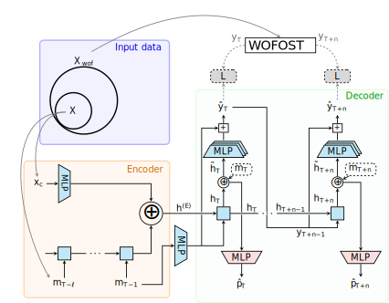

# PG-Sequence Learning
This repository contains the code to reproduce the main experiments from the paper: **Physics-Guided Sequence Learning for Crop Growth Surrogate Modeling.**

## Introduction
We introduce a physics-guided framework for building seq2seq reduced-order surrogate models of the WOFOST crop growth model. By explicitly enforcing physical consistency, the framework improves predictive accuracy, guides learning toward more generalizable hypotheses, and enhances robustness under out-of-distribution (OOD) conditions.

<p align="center">
  
</p>

## Quick reproduction (TL;DR)
> Exemple for experiment $`\mathrm{S2S}_{msd}`$ in Table 2 (on the paper). 

```bash
git clone https://github.com/JulAgu/pg-sequence_learning.git
cd pg-sequence_learning

conda create -n pg_seq2seq
conda activate pg_seq2seq
conda install python=3.10.0
pip install -r requirements.txt

# download dataset and place in data/

python train.py -m experiment@_global_="010"
```

## Setting up the project
**1. Software Requirements:** A Python installation in an isolated environment is highly recommended. We used **Python v3.10.0** and **Miniconda**. All necessary dependencies can be installed directly from the `requirements.txt` file.

```bash
conda create -n pg_seq2seq
conda activate pg_seq2seq
conda install python=3.10.0
pip install -r requirements.txt
```

**2. Obtain the dataset by following the instructions in the [Data](#data) section.**

**NOTE – Hardware Setup:** Experiments were executed using an NVIDIA RTX A6000 GPU (48 GB) on a machine with an Intel(R) Core(TM) i7-14700 CPU and 125 GB of RAM. Under this setup, the average training time for the longest experiments was 95 minutes.

## Experiments
Experiments were designed to be easily run using [Hydra](https://hydra.cc/). Each base model has a corresponding config file in `conf/experiment`:

| Model               | Config File  | Training script     |
|---------------------|--------------|---------------------|
| $\text{S-S2S}$      | `01.yaml`    | `train_smalls.py`   |
| $\text{S-S2S}_m$    | `02.yaml`    | `train_smalls.py`   |
| $\mathrm{S2S}$      | `03.yaml`    | `train.py`          |
| $\mathrm{S2S}_{s}$  | `05.yaml`    | `train.py`          |
| $\mathrm{S2S}_{d}$  | `06.yaml`    | `train.py`          |
| $\mathrm{S2S}_{sd}$ | `07.yaml`    | `train.py`          |
| $\mathrm{S2S}_{m}$  | `04.yaml`    | `train.py`          |
| $\mathrm{S2S}_{ms}$ | `08.yaml`    | `train.py`          |
| $\mathrm{S2S}_{md}$ | `09.yaml`    | `train.py`          |
| $\mathrm{S2S}_{msd}$| `010.yaml`   | `train.py`          |

From these config files, you can train the models on the two partitions proposed in the paper and replicate the grid search experiments for the coefficients of the composite loss function.

**Example:** Executing $`\mathrm{S2S}_{msd}`$ in the $`\mathcal{D}_{\text{OOD-G}}`$ partition:

```bash
python train.py -m experiment@_global_="010" training.dataset_object._target_="datasets.dataOps.create_loc_ood_datasets"
```

The code also allows exploration of alternative approaches to tuning the loss function coefficients that were not discussed in the paper. For example, [SoftAdapt](https://arxiv.org/abs/1912.12355) is fully integrated into the code, and `trainer.py` is ready to support other dynamic coefficient allocation techniques.

**Experiments are monitored using [TensorBoard](https://www.tensorflow.org/tensorboard) and [MLflow](https://mlflow.org/). Thanks to MLflow tracking, model evaluation can be performed later by referring to the run ID.**

### Additional experiments
In the paper, we propose two additional experiments that:

**(1)** test the capacity of the fully physically constrained model in few-shot learning;

**(2)** illustrate the use of the surrogate model to answer a recurring agronomic question by solving an inverse problem.

**(1)** can be executed using the `train_FSL.py` script and the `03_FSL.yaml` config file, while **(2)** can be performed using the `PH_0_solving_a_real_agronomic_problem.ipynb` and `PH_1_solving_a_real_agronomic_problem.ipynb` notebooks.

### Evaluation
Evaluation on the test and OOD subsets can be performed using the `generating_test_results.ipynb` and `generating_test_results_small.ipynb` notebooks by providing the target MLflow run IDs.

## Data
The dataset was constructed by performing WOFOST simulations on real data from agricultural plots in northwestern France. To ensure data anonymity, categorical variables that could reveal identity were transformed into ordinal variables. Similarly, the coordinates of the plots were shifted by an unknown offset.

Due to GitHub’s restrictions on storing large files, the dataset must be downloaded from Hugging Face 🤗 and added to the project by following these steps:

1. Download the dataset from: https://huggingface.co/datasets/JulAgu/PG_S2S-Crop_development  
2. Create a `data/` directory in the root of the project and place the dataset files inside.
